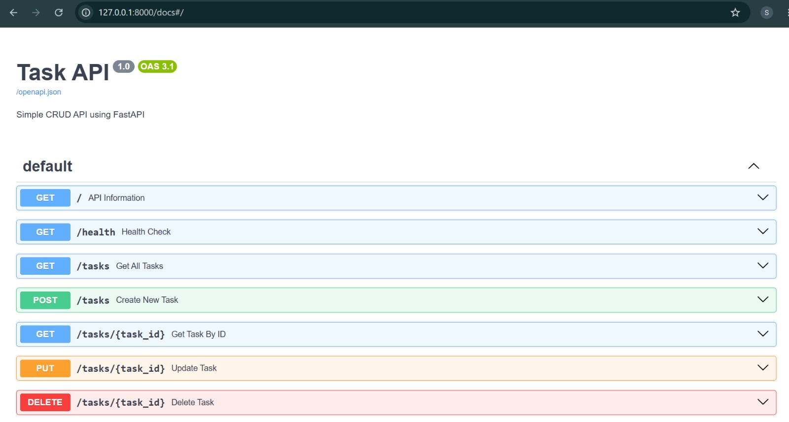
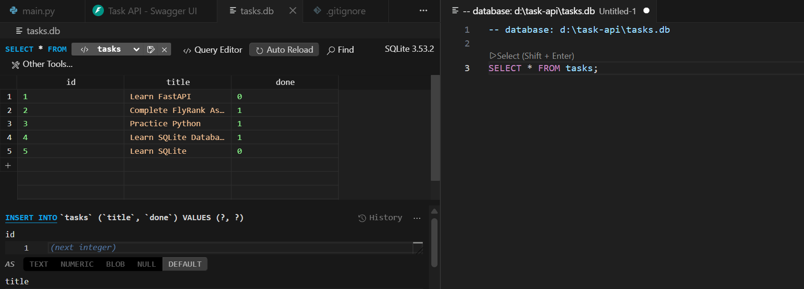

# FlyRank Task API (SQLite)

A RESTful Task Management API built with **FastAPI** and **SQLite**. This project supports full CRUD (Create, Read, Update, Delete) operations and stores data persistently using a SQLite database.

---

## Features

- Create tasks
- Read all tasks
- Read a task by ID
- Update tasks
- Delete tasks
- SQLite database for persistent storage
- Interactive Swagger UI documentation

---

## Tech Stack

- Python 3
- FastAPI
- SQLite
- Uvicorn
- Pydantic

---

## Installation

Clone the repository:

```bash
git clone https://github.com/Sukhsimransingh1/flyrank-task-api.git
cd flyrank-task-api
```

Create a virtual environment:

```bash
python -m venv venv
```

Activate the environment:

### Windows

```bash
venv\Scripts\activate
```

### Linux / macOS

```bash
source venv/bin/activate
```

Install dependencies:

```bash
pip install -r requirements.txt
```

---

## Run the API

```bash
uvicorn main:app --reload
```

Swagger UI:

```
http://127.0.0.1:8000/docs
```

---

## API Endpoints

| Method | Endpoint | Description |
|---------|----------|-------------|
| GET | / | Root endpoint |
| GET | /health | Health check |
| GET | /tasks | Get all tasks |
| GET | /tasks/{id} | Get task by ID |
| POST | /tasks | Create a task |
| PUT | /tasks/{id} | Update a task |
| DELETE | /tasks/{id} | Delete a task |

---

## SQLite Database

The application stores all task data in a local SQLite database (`tasks.db`). The database and table are created automatically when the application starts. Three sample tasks are inserted only if the table is empty.

Example SQL query:

```sql
SELECT * FROM tasks;
```

---

## Screenshots

### Swagger UI

Create an `images` folder and save your Swagger screenshot as:

```
images/swagger-ui.png
```

Then reference it:

```markdown

```

---

### SQLite Database

Save your DB Browser screenshot as:

```
images/sqlite-db.png
```

Then reference it:

```markdown

```

---

## Project Structure

```
flyrank-task-api/
│── images/
│   ├── swagger-ui.png
│   └── sqlite-db.png
│── main.py
│── requirements.txt
│── README.md
│── .gitignore
```

---

## Author

Sukhsimran Singh